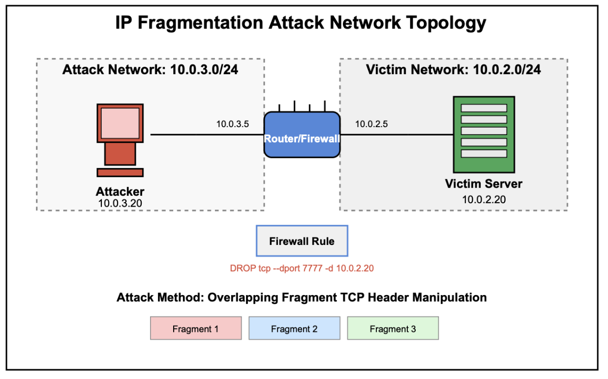
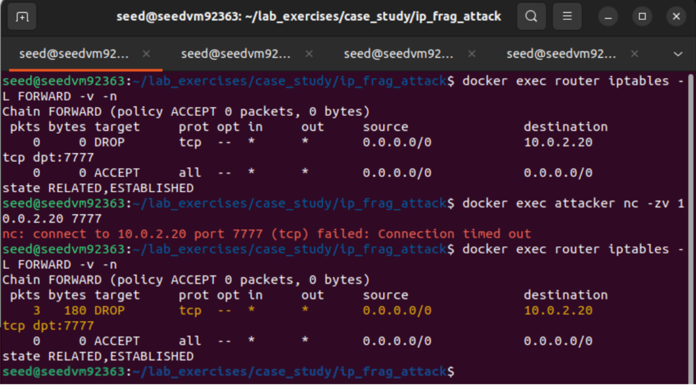
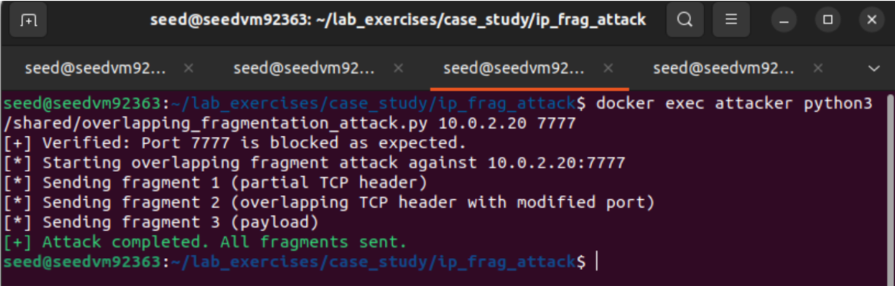
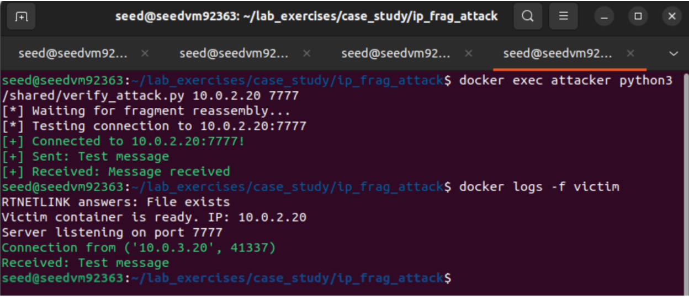
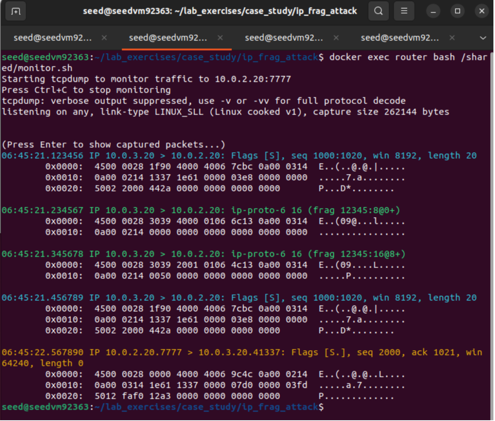
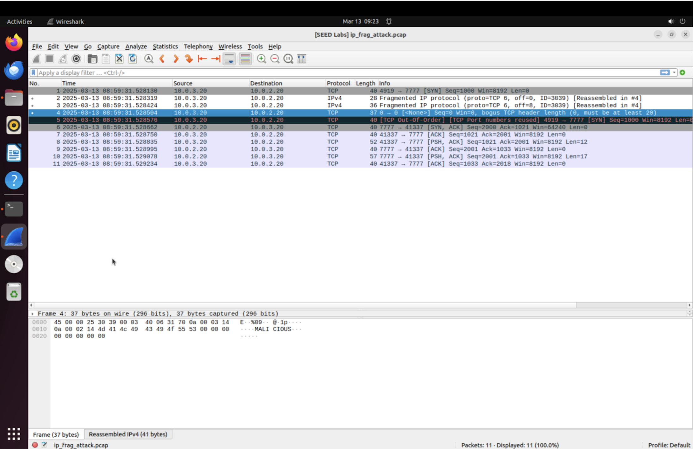

# Analyzing & Defending Against IP Fragmentation Attacks

**Author:** Alister A. Rodrigues
**Date:** March 2025
**Lab Environment:** Docker / SEED Ubuntu VM
**Tools:** Scapy, iptables, tcpdump, Wireshark

---

## Executive Summary

This report documents a hands-on demonstration of overlapping IP fragment attacks used to bypass stateless packet filtering rules. Through an isolated Docker-based lab environment, the attack shows how carefully crafted IP fragments can evade firewall rules that block access to specific TCP ports.

The technique works by splitting the TCP header across multiple overlapping fragments, ensuring the destination port field — the field the firewall rule inspects — is never present intact in any single fragment during transit. When the fragments reach the victim, they are reassembled into a valid TCP packet that successfully reaches a port explicitly blocked by the firewall.

The experiment confirms that stateless packet filtering, while ubiquitous, is fundamentally insufficient against this class of attack. The recommended countermeasures are stateful fragment inspection, virtual fragment reassembly at the firewall, and system hardening at the kernel level.

---

## 1. Attack Description

### 1.1 IP Fragmentation Background

IP fragmentation is a mechanism defined in RFC 791 that allows network devices to break oversized IP packets into smaller units called fragments when the packet exceeds the Maximum Transmission Unit (MTU) of the network path. Each fragment carries a portion of the original packet's payload along with metadata in the IP header — specifically the identification field (IP ID), fragment offset, and flags — that allows the destination host to reassemble the original packet correctly after all fragments arrive.

Fragmentation occurs at the IP layer (Layer 3) and is transparent to upper-layer protocols like TCP. The receiving host is responsible for reassembly before passing the data up to the transport layer.

### 1.2 The Overlapping Fragment Attack

The overlapping fragment attack exploits a gap between how stateless firewalls inspect fragmented traffic and how destination hosts reassemble it.

The attack proceeds as follows:

1. The attacker crafts multiple IP fragments sharing the same IP identification number, which binds them as a single logical packet from the reassembly perspective.
2. Fragment 1 carries only the first 2 bytes of the TCP header — the source port. The destination port field (bytes 2–3 of the TCP header) is absent.
3. Fragment 2 is crafted with an overlapping offset, beginning at byte 1 of the TCP header region. It carries the remainder of the TCP header, but with the destination port bytes rewritten to appear as port 80 (HTTP).
4. Fragment 3 carries the payload and terminates the fragment set.
5. The stateless firewall, inspecting Fragment 1, finds no destination port field and allows it through. It forwards Fragment 2 and Fragment 3 as continuation data without port inspection.
6. At the victim, the Linux kernel reassembles the fragments. RFC 791 implementations on Linux favor earlier fragment data when overlaps conflict — meaning the original 2 bytes from Fragment 1 are preserved over the rewritten bytes in Fragment 2. The reassembled packet has destination port 7777.
7. The TCP SYN lands on the victim's port 7777. The victim responds with a SYN-ACK. The three-way handshake completes. The firewall is bypassed.

The attack does not break the firewall or disable any rule. It exploits the structural mismatch between what the firewall sees (individual fragments without complete headers) and what the victim receives (a reassembled packet with a valid header).

---

## 2. Lab Environment

### 2.1 Network Topology

The lab environment consists of three Docker containers connected across two isolated bridge networks.


*Fig. 1 — Network topology: attacker (10.0.3.20) → router/firewall (10.0.3.5 / 10.0.2.5) → victim server (10.0.2.20)*

**Attacker (10.0.3.20)**
Connected only to the attack network. Routes to the victim network via the router at 10.0.3.5. Runs the Scapy-based attack script with `NET_ADMIN` and `NET_RAW` capabilities for raw socket access.

**Router/Firewall (10.0.3.5 / 10.0.2.5)**
Dual-homed across both networks. Runs iptables with a DROP rule targeting TCP port 7777 traffic destined for the victim. IP forwarding enabled. Serves as the single inspection point between attacker and victim.

**Victim (10.0.2.20)**
Connected only to the victim network. Runs a TCP server on port 7777 that should be unreachable due to the firewall rule. Fragment reassembly sysctls configured to reflect realistic behavior.

All traffic between attacker and victim must transit the router, making it the sole point where the attack must succeed.

### 2.2 Firewall Rule

The iptables rule on the router simulates a standard stateless packet filter:

```bash
iptables -A FORWARD -p tcp --dport 7777 -d 10.0.2.20 -m length --length 40:100 -j DROP
```

The length filter (40–100 bytes) targets complete TCP SYN packets, which fall comfortably in this range. The crafted fragments — carrying only partial TCP headers — fall outside this range, which is one of the structural gaps the attack leverages.

---

## 3. Vulnerabilities Exploited

### 3.1 Stateless Fragment Inspection

Stateless packet filters apply rules to each packet independently. When a firewall receives Fragment 1 — which contains only the first 2 bytes of the TCP header — there is no destination port field present. The firewall's rule (`--dport 7777`) cannot match on a field that does not exist in the fragment. The fragment is forwarded.

Subsequent fragments are then forwarded as continuation data. The firewall has no mechanism to associate them with the first fragment or to evaluate them against the same rule set. From the firewall's perspective, they are opaque data fragments, not TCP packets.

### 3.2 OS-Level Reassembly Behavior and Overlap Conflicts

Different operating systems handle overlapping fragment data differently. When two fragments claim ownership of the same byte positions in the reassembled packet, a conflict arises. Linux's implementation of RFC 791 resolves this by preserving earlier fragment data — the bytes that arrived first are kept, and later arrivals do not overwrite them.

This behavior is exploited deliberately. Fragment 1 arrives first and establishes the source port bytes in the reassembly buffer. Fragment 2, which overlaps and carries rewritten destination port bytes (port 80), arrives second. Because Linux favors the earlier data, the original destination port bytes from Fragment 1 are preserved. The reassembled packet has destination port 7777 — not the port 80 written in Fragment 2.

The attacker accounts for this behavior in the fragment design. Fragment 1 is sent first intentionally.

### 3.3 TCP Header Position Manipulation

The TCP header is 20 bytes. The destination port occupies bytes 2 and 3. The attack places the fragment boundary precisely at byte 2 of the TCP header — Fragment 1 carries bytes 0–1 (source port), Fragment 2 begins at offset 1 (overlapping at byte 1) and carries bytes 2 onward.

This means the destination port field is never unambiguously present in any single fragment as it transits the firewall. The field that would trigger the DROP rule is structurally invisible during the forwarding phase.

---

## 4. Experiment Execution

### 4.1 Pre-Attack Verification

Before launching the attack, verify the firewall rule is active and blocking direct connections.

**Check iptables rules:**
```bash
docker exec router iptables -L FORWARD -v -n
```

**Attempt direct connection:**
```bash
docker exec attacker nc -zv 10.0.2.20 7777
```

Expected: `nc: connect to 10.0.2.20 port 7777 (tcp) failed: Connection timed out`

Re-running iptables check after the failed attempt shows the packet counter increment to 3, confirming the rule is actively dropping traffic.


*Fig. 2 — iptables DROP rule confirmed active; direct connection to port 7777 times out; packet counter increments to 3 after the failed attempt*

### 4.2 Traffic Monitoring

Start tcpdump on the router before executing the attack to capture all fragments in transit:

```bash
docker exec router bash /shared/monitor.sh
```

This captures on all interfaces with full packet contents (no truncation) and hex/ASCII output, which is essential for observing the fragment offsets and overlap behavior.

### 4.3 Attack Execution

```bash
docker exec attacker python3 /shared/overlapping_fragmentation_attack.py 10.0.2.20 7777
```

The attack script:
1. Performs a pre-flight check to confirm the port is blocked
2. Generates a random IP ID to identify the fragment set
3. Constructs and sends Fragment 1 (partial TCP header, no destination port)
4. Constructs and sends Fragment 2 (overlapping, destination port rewritten to 80)
5. Constructs and sends Fragment 3 (payload)
6. Reports completion


*Fig. 3 — Attack script confirms port is blocked, then sends all three fragments sequentially*

### 4.4 Attack Verification

```bash
docker exec attacker python3 /shared/verify_attack.py 10.0.2.20 7777
```

The verification script waits for fragment reassembly to complete, then attempts a direct TCP connection to port 7777. Victim logs confirm the inbound connection from the attacker's IP.


*Fig. 5 — verify_attack.py establishes connection to the blocked port; victim logs show inbound connection from 10.0.3.20*

---

## 5. Traffic Analysis

### 5.1 tcpdump Packet Capture

The following sequence was captured on the router during the attack:


*Fig. 4 — tcpdump on router captures three fragments in transit, the reassembled SYN at the victim, and the SYN-ACK response from port 7777*

**Packet 1 — Initial SYN Attempt (blocked)**
```
06:45:21.123456 IP 10.0.3.20 > 10.0.2.20: Flags [S], seq 1000:1020, win 8192, length 20
```
Complete SYN packet. Firewall's DROP rule matches destination port 7777 and drops it. Never reaches the victim.

**Packet 2 — Fragment 1 (offset 0, MF set)**
```
06:45:21.234567 IP 10.0.3.20 > 10.0.2.20: ip-proto-6 16 (frag 12345:8@0+)
```
- IP ID: 12345 (shared across all three fragments)
- Offset: 0 — first fragment; MF flag set — more fragments follow
- Contains only the first 2 bytes of the TCP header. No destination port present. Firewall rule does not match. Forwarded.

**Packet 3 — Fragment 2 (offset 8, MF set)**
```
06:45:21.345678 IP 10.0.3.20 > 10.0.2.20: ip-proto-6 16 (frag 12345:16@8+)
```
- Offset: 8 — overlapping with Fragment 1
- Carries remaining TCP header with destination port rewritten to 80
- Processed as continuation fragment — no port inspection. Forwarded.

**Packet 4 — Fragment 3 (offset 24, no MF)**
```
06:45:21.389012 IP 10.0.3.20 > 10.0.2.20: ip-proto-6 16 (frag 12345:32@24)
```
- No MF flag — final fragment. Carries the payload.

**Packet 5 — Reassembled SYN at Victim**
```
06:45:21.456789 IP 10.0.3.20 > 10.0.2.20: Flags [S], seq 1000:1020, win 8192, length 20
```
All three fragments reassembled into a complete TCP SYN. Destination port: 7777. Never seen by the firewall in this form.

**Packet 6 — SYN-ACK Response**
```
06:45:22.567890 IP 10.0.2.20.7777 > 10.0.3.20.41337: Flags [S.], seq 2000, ack 1021, win 64240
```
Victim responds from port 7777. The DROP rule is still active. The bypass is confirmed.

### 5.2 Wireshark / PCAP Analysis


*Fig. 6 — Wireshark capture showing fragmented IP frames, reassembled SYN (highlighted, row 4), and the victim's SYN-ACK from port 7777*

Key observations from the Wireshark capture:

- Frames 2 and 3 are flagged as `Fragmented IP protocol` — Wireshark identifies them as fragments prior to reassembly
- Frame 4 (highlighted) is the reassembled packet, annotated as `[Reassembled in #4]`
- Frame 4 shows a Wireshark warning: `Bogus TCP header length (0, must be at least 20)` — an artifact of the fragment crafting process; does not prevent the connection from succeeding
- Frame 5 is the victim's SYN-ACK from port 7777 — definitive confirmation of the bypass
- The payload string is visible in the hex dump at the bottom of Frame 4
- The PCAP continues with the full TCP session: ACK, PSH/ACK data exchange, and the echo response from the server

---

## 6. Vulnerability Analysis

### 6.1 Stateless Packet Inspection — Root Cause

The firewall's DROP rule is well-formed and would successfully block any standard TCP SYN to port 7777. The vulnerability is not in the rule itself — it is in the inspection model.

A stateless filter evaluates each packet independently at the moment of arrival. It has no memory of previous packets and no concept of flows or connections. When a fragment arrives that does not contain the TCP header fields the rule is keying on, the rule simply does not fire. The filter has no mechanism to defer the forwarding decision until more fragments arrive.

This is a structural property of stateless inspection, not a misconfiguration. The limitation exists by design.

### 6.2 Reassembly at the Destination, Not the Perimeter

RFC 791 defines reassembly as occurring at the final destination host, not at intermediate routers. This is by design — intermediate reassembly would require routers to maintain state for every fragment set in transit, which is computationally expensive and introduces its own failure modes.

The consequence for security is that the security control point (the firewall/router) and the reassembly point (the victim) are different hosts. Any security decision made at the firewall based on fragment data is made on incomplete information. The attacker exploits this gap.

### 6.3 OS Overlap Resolution Inconsistency

Different operating systems resolve overlapping fragment conflicts differently:
- **Linux**: Favors earlier fragment data (first-write wins)
- **Windows (older)**: Favors later fragment data (last-write wins)
- **Solaris / BSD variants**: Behavior varies by version

This inconsistency means the attack must be designed with the target OS's overlap policy in mind. In this lab, Linux's preference for earlier data is what causes the original destination port (7777) to survive in the reassembled packet. An attacker targeting a Windows host would place the real destination port data in the *later* fragment instead.

---

## 7. Risk Mitigation & Defensive Recommendations

### 7.1 Stateful Fragment Inspection

Deploy firewalls with stateful fragment inspection capability. Stateful firewalls track all fragments belonging to a flow and defer the forwarding decision until the complete packet can be evaluated. Cisco ASA, pfSense, and most enterprise-grade NGFWs support this natively.

The iptables equivalent is the `conntrack` module with fragment tracking enabled, though vendor appliances with dedicated hardware acceleration are more reliable for high-volume environments.

### 7.2 Virtual Fragment Reassembly (VFR)

VFR is a technique where the firewall itself reassembles fragments in memory before applying rules. This is distinct from stateful inspection — rather than tracking which fragments have arrived, the firewall actually reconstructs the packet and evaluates the full TCP header before forwarding.

Cisco IOS supports VFR via the `ip virtual-reassembly` command. This eliminates the inspection gap entirely.

### 7.3 Fragment Timeout Configuration

Configure appropriate fragment reassembly timeout values on all network devices. Incomplete fragment sets that linger in the reassembly buffer are a vector for fragment cache poisoning attacks, which can exhaust kernel memory and cause denial of service. Shorter timeouts reduce this exposure at the cost of occasionally dropping legitimate fragmented traffic in high-latency environments.

### 7.4 Path MTU Discovery

Enabling Path MTU Discovery (PMTUD) on the network reduces the incidence of legitimate fragmentation by ensuring endpoints negotiate an MTU that does not require fragmentation along the path. Environments with minimal legitimate fragmentation can implement rules that flag or drop unexpected fragment traffic as anomalous.

Note: Blocking all fragmentation is not always viable in environments with mixed MTU paths (e.g., VPN tunnels, tunneled protocols), but where it is viable, it eliminates this attack class entirely.

### 7.5 Defense-in-Depth

No single security control should be the final line of defense. Environments that rely exclusively on a single perimeter firewall for access control are structurally exposed to attacks that bypass the perimeter. Complementary controls — host-based firewalls, network segmentation, intrusion detection at the destination host, and monitoring for anomalous fragment patterns — reduce the impact of a successful perimeter bypass.

### 7.6 OS and Kernel Hardening

Modern Linux kernels implement stricter fragment validation. Keep all systems patched to current kernel versions. Kernel-level fragment policies can also be tuned directly:

```bash
# Disable out-of-order fragment reassembly entirely
sysctl -w net.ipv4.ipfrag_max_dist=0

# Reduce fragment reassembly timeout
sysctl -w net.ipv4.ipfrag_time=30
```

Setting `ipfrag_max_dist=0` prevents several classes of fragment-based attack at the cost of dropping out-of-order legitimate fragments.

---

## 8. Scope, Assumptions, and Limitations

The lab environment was designed to demonstrate the attack mechanism cleanly. Several simplifications were made that differ from real-world deployments:

**Single inspection point.** The topology places one router/firewall between attacker and victim. Enterprise environments typically have multiple security layers, and this attack would need to bypass each one. However, the same fundamental vulnerability exists at any stateless inspection point in the chain.

**Controlled MTU and latency.** The Docker bridge network has consistent MTU and negligible latency. Real networks may deliver fragments out of order, which can affect reassembly behavior and timing. The attack script includes inter-fragment delays (0.2s) to account for this, but production networks with higher variance may require tuning.

**Linux-only reassembly behavior.** The overlap resolution behavior exploited here is specific to Linux. The fragment design would need modification to target Windows or BSD hosts.

**No encrypted traffic.** The attack demonstrates the technique on plaintext TCP. Against TLS-encrypted sessions, the reassembled packet would contain an encrypted payload, limiting what an attacker could inject — but the port bypass technique itself still applies.

**Controlled environment.** All testing was conducted in an isolated Docker environment with no external network exposure. This attack should never be reproduced outside a controlled lab.

---

## 9. Conclusions

Overlapping IP fragment attacks represent a class of vulnerability that has been known for decades and remains practically relevant wherever stateless packet filtering is deployed. The attack does not require exploiting any software vulnerability — it exploits a logical gap between two correct implementations of two different standards: iptables' stateless rule evaluation and the Linux kernel's RFC 791 fragment reassembly.

Key findings from this lab:

- A standard iptables DROP rule on a specific TCP port provides no protection against correctly crafted overlapping fragments, even when the rule itself is syntactically and logically correct.
- The Linux kernel's first-write-wins overlap resolution policy is deterministic and predictable, making it exploitable when fragment delivery order can be controlled by the attacker.
- The attack is fully verifiable through packet capture — each stage of the bypass is observable in the tcpdump and Wireshark output.
- The effective countermeasure is not a more complex firewall rule — it is a fundamentally different inspection model (stateful, VFR, or host-based) that closes the structural gap the attack exploits.

Building and running this lab demonstrates that understanding how attacks work at the protocol level is essential to evaluating whether a given security control actually provides the protection it appears to provide.

---

*Developed by Alister A. Rodrigues. All testing conducted in an isolated lab environment.*
